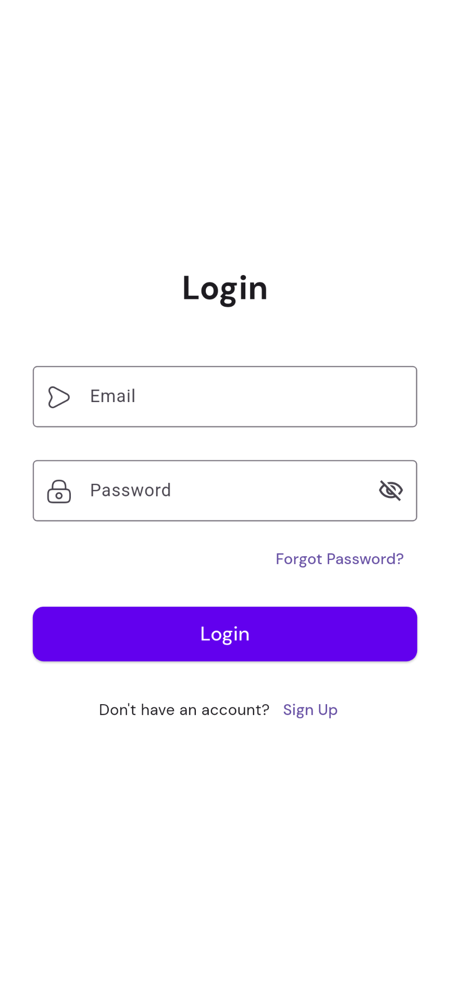
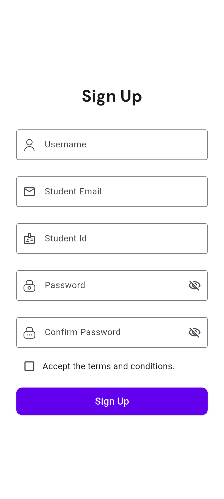
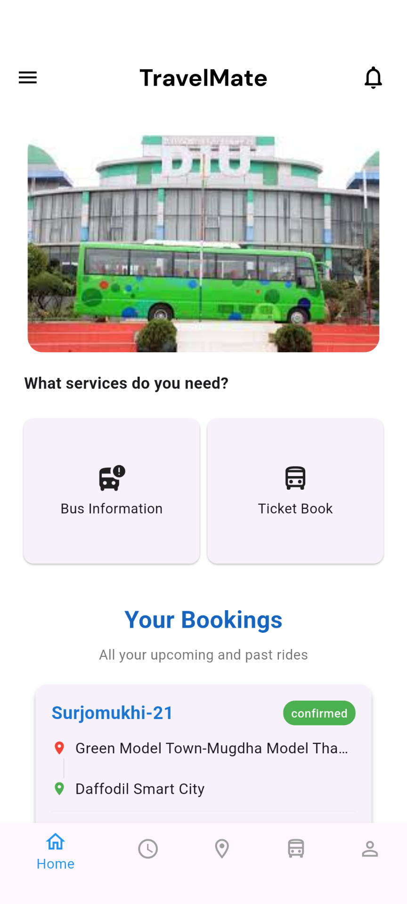
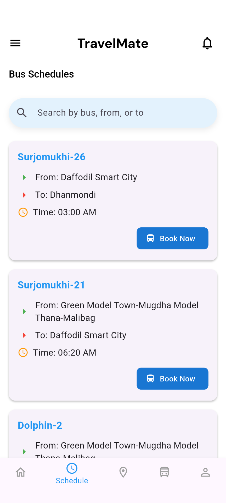
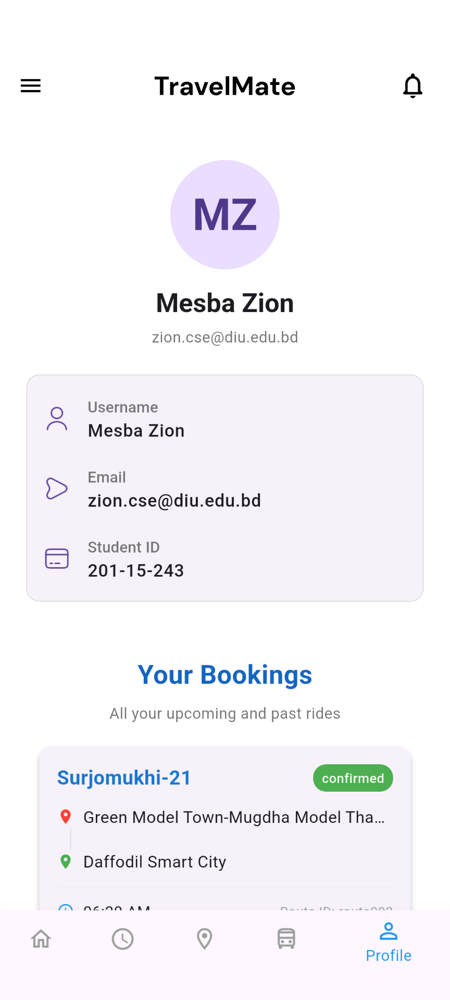

# DIU TravelMate

**DIU TravelMate** is a transport management app designed for our university to streamline daily transport operations, enhance user experience, and provide innovative features beyond conventional solutions.

---

## 🚀 Features

### 🔹 Core System
- Efficient transport management for the university.
- Seamless user interface for students and staff.
- Optimized routes and schedules.

### 📍 Real-time Tracking
- Live tracking of university transport.
- Estimated arrival times for convenience.
- Interactive map with bus locations.

### 🎫 Smart Ticketing
- Digital ticket booking system.
- Secure QR-based ticket verification.
- Payment integration for a hassle-free experience.

### 🔔 Instant Alerts
- Real-time notifications for schedule updates.
- Emergency alerts and service status updates.
- Custom reminders for bus timings.

### 📝 Feedback System
- Rate and review transport services.
- Submit complaints and suggestions.
- Data-driven service improvements.

---

## 📸 Looks of our App
<table>
  <tr>
    <td></td>
    <td></td>
    <td></td>
  </tr>
  <tr>
    <td></td>
    <td></td>
    <td></td>
  </tr>
</table>


🎬 [Watch Demo on YouTube](https://youtube.com/shorts/jOmKtQhUx_4?feature=share)


---


## 🎯 Competitive Edge
- **User-Friendly Interface**: Intuitive design tailored for students and staff.
- **AI-Optimized Routes**: Smarter scheduling for efficient transport.
- **Secure & Reliable**: Encrypted data transactions for safety.
- **Community-Driven**: Enhancements based on real user feedback.

---

## 🛠 Tech Stack
- **Frontend**: Flutter (for mobile application)
- **Backend**: Node.js / Django (for handling requests & authentication)
- **Database**: Firebase (for data storage)
- **Maps & Tracking**: Google Maps API / OpenStreetMap
- **Notifications**: Firebase Cloud Messaging / Twilio

---

## 📦 Download the App

[⬇️ Download APK](build/app/outputs/flutter-apk/app-release.apk)


## 📌 Build Guide

1. Clone the repository:
   ```sh
   git clone https://github.com/yourusername/DIU_TravelMate.git
   ```
2. Navigate to the project directory:
   ```sh
   cd DIU_TravelMate
   ```
3. Install dependencies:
   ```sh
   flutter pub update
   ```
4. Start the application:
   ```sh
   flutter run
   ```

---
## Documentaion
📄 [View PDF](https://drive.google.com/file/d/1fnBlvlYVlCng2TISymz8sSnuE4lZXsPD/view?usp=sharing)

---

## 👥 Team


---

## 🤝 Contributing
We welcome contributions! Feel free to submit a pull request or open an issue for discussion.

---

## 📄 License
This project is licensed under the **MIT License** – see the [LICENSE](LICENSE) file for details.

---

## 📢 Connect With Us
For any queries or support, feel free to reach out:
📧 Email: mdmamunurrashidhridoy@gmail.com | moshiurrrahman@gmail.com | sakibkhan@gmail.com  
🌐 Website: [DIU TravelMate](https://yourwebsite.com)  
🐦 Twitter: [@DIUTravelMate](https://twitter.com/DIUTravelMate)

