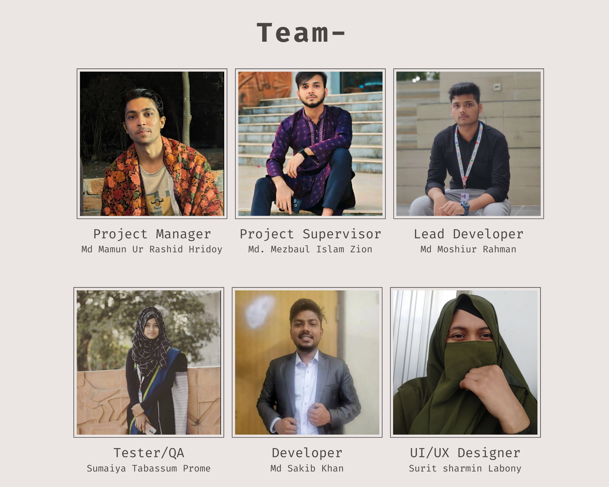

# DIU TravelMate

**DIU TravelMate** is a transport management app developed for our university that streamlines daily transportation operations, enhances user experience, and provides innovative features beyond conventional solutions.

## 🚀 Features

### 🔹 Core System
- Comprehensive transport management system for university operations
- Intuitive user interface designed specifically for students and staff
- Optimized routes and schedules to maximize efficiency

### 📍 Real-time Tracking
- Live tracking of all university transport vehicles
- Accurate estimated arrival times for improved planning
- Interactive map displaying current bus locations

### 🎫 Smart Ticketing
- Paperless digital ticket booking and management
- Secure QR code-based ticket verification system
- Seamless payment integration for hassle-free transactions

### 🔔 Instant Alerts
- Real-time notifications for any schedule changes or delays
- Critical emergency alerts and service status updates
- Customizable reminders for personal bus schedules

### 📝 Feedback System
- Rate and review transport services after each journey
- Submit complaints and suggestions for continuous improvement
- Data-driven service enhancements based on user feedback

## 📸 Looks of our App
<table>
  <tr>
    <td></td>
    <td></td>
    <td></td>
  </tr>
  <tr>
    <td></td>
    <td></td>
    <td></td>
  </tr>
</table>

🎬 [Watch Demo on YouTube](https://youtube.com/shorts/jOmKtQhUx_4?feature=share)

## 🎯 Competitive Edge
- **User-Friendly Interface**: Thoughtfully designed with students and staff in mind
- **AI-Optimized Routes**: Smart algorithms for efficient scheduling and resource allocation
- **Secure & Reliable**: End-to-end encrypted data transactions for maximum safety
- **Community-Driven**: Continuous improvement based on actual user experiences

## 🛠 Tech Stack
- **Frontend**: Flutter (cross-platform mobile application development)
- **Backend**: Node.js / Django (robust request handling & authentication)
- **Database**: Firebase (real-time data storage and synchronization)
- **Maps & Tracking**: Google Maps API / OpenStreetMap (location services)
- **Notifications**: Firebase Cloud Messaging / Twilio (communication services)

## 📦 Download the App

[⬇️ Download APK](build/app/outputs/flutter-apk/app-release.apk)

## 📌 Build Guide

1. Clone the repository:
   ```sh
   git clone https://github.com/yourusername/DIU_TravelMate.git
   ```
2. Navigate to the project directory:
   ```sh
   cd DIU_TravelMate
   ```
3. Install dependencies:
   ```sh
   flutter pub update
   ```
4. Start the application:
   ```sh
   flutter run
   ```

## Documentation
📄 [View PDF in Google Drive](https://drive.google.com/file/d/1fnBlvlYVlCng2TISymz8sSnuE4lZXsPD/view?usp=sharing)
[View Overleaf Documentation](https://www.overleaf.com/read/bpbrwmgpbccc#7e7bb7)

## 👥 Team


## 🤝 Contributing
We welcome contributions from the community! Please feel free to submit a pull request or open an issue for discussion.

## 📄 License
This project is licensed under the **MIT License** – see the [LICENSE](LICENSE) file for details.

## 📢 Connect With Us
For any queries or support, feel free to reach out:
📧 Email: mdmamunurrashidhridoy@gmail.com | moshiurrrahman@gmail.com | sakibkhan@gmail.com  
🌐 Website: [DIU TravelMate](https://github.com/mdmamunurrashidhridoy/DIU_TravelMate)  
🐦 Twitter: [@DIUTravelMate](https://twitter.com/DIUTravelMate)